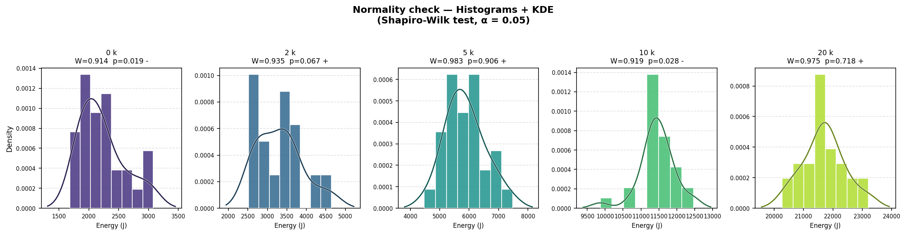
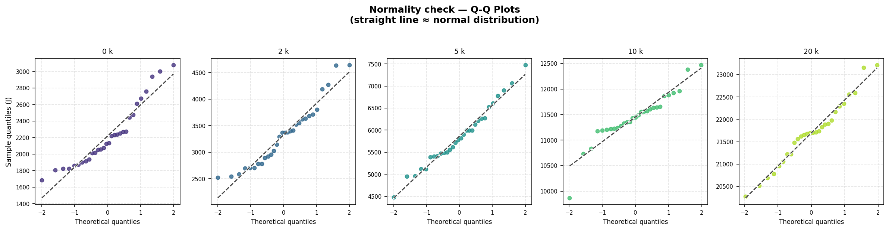
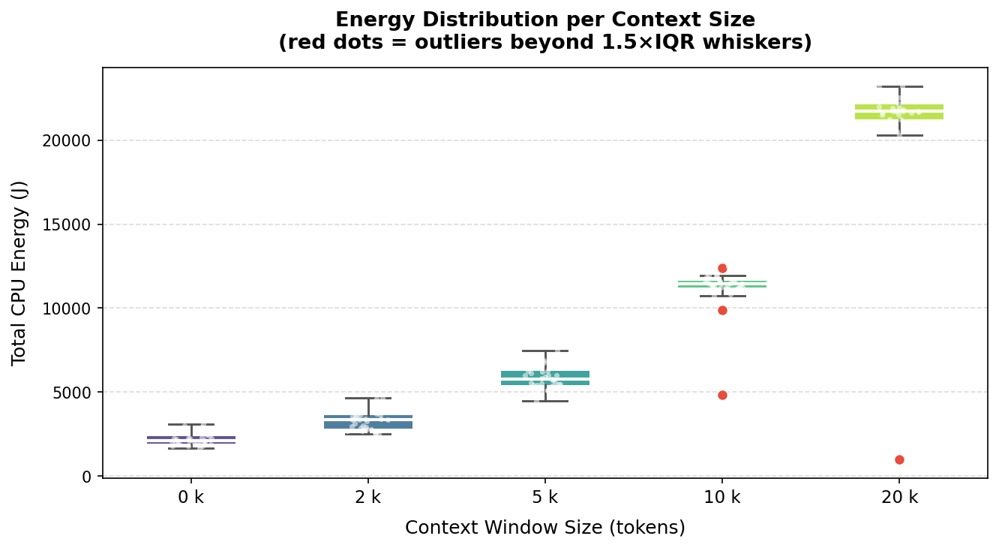
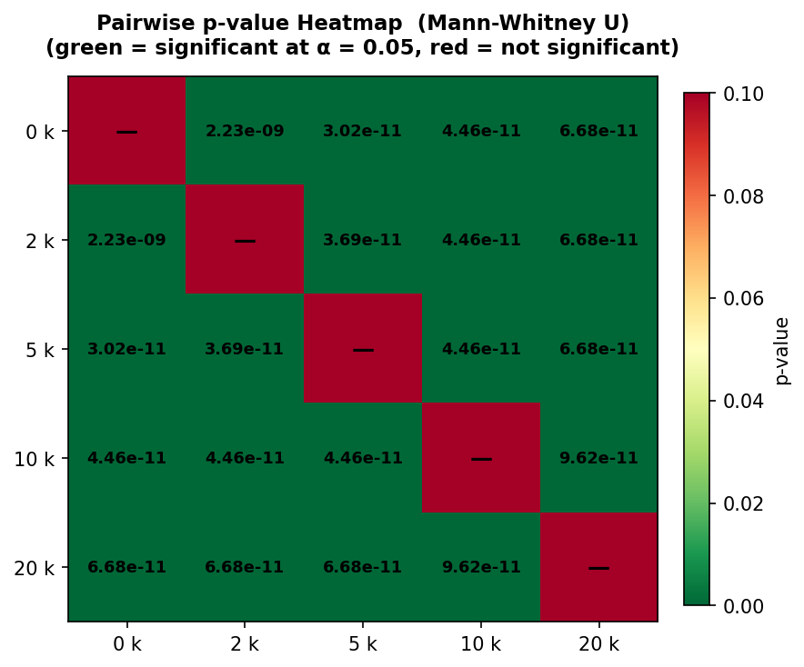
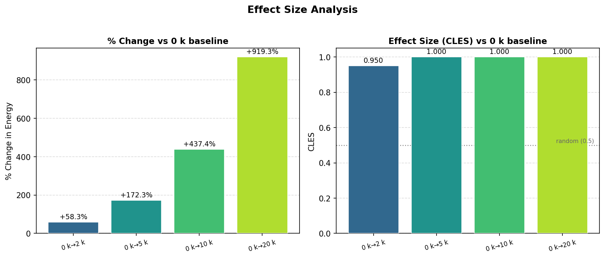
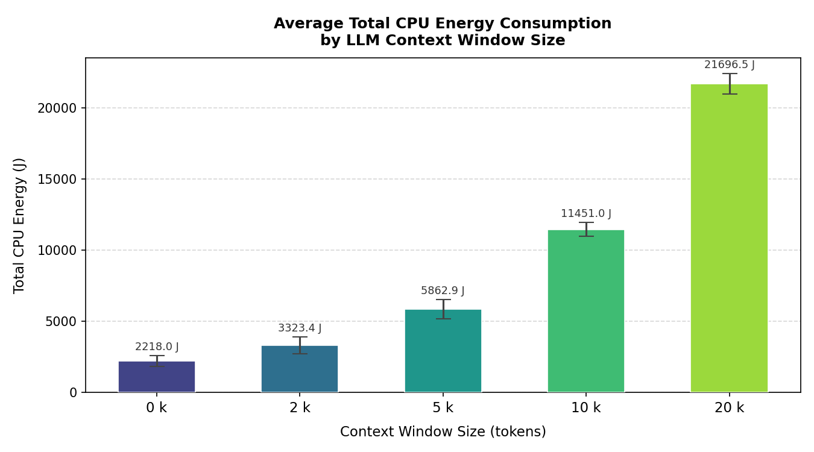
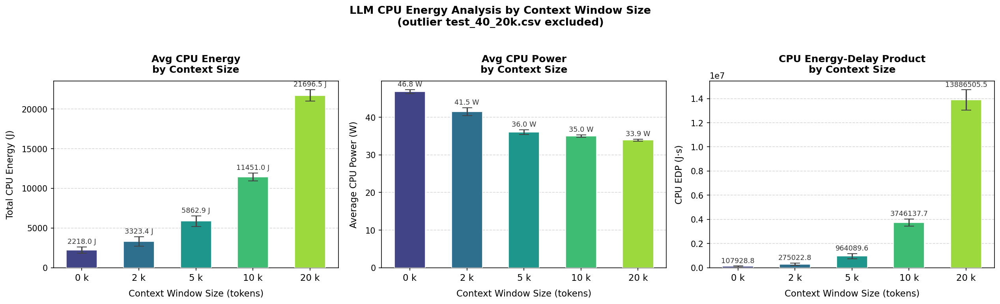
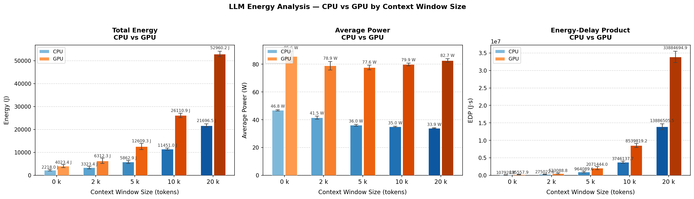
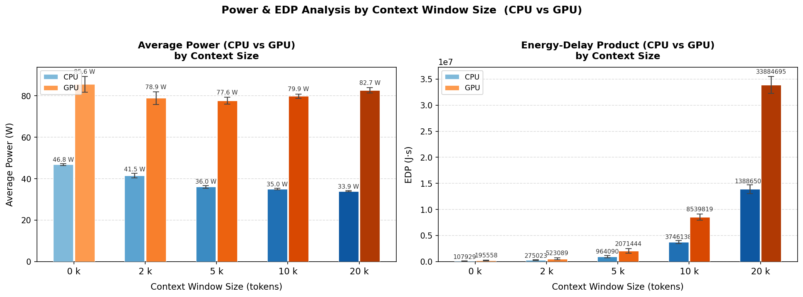

# Introduction

Large Language Models (LLMs) have been prominent for years, and users from different fields want to get the best performance from their models. Now that agentic LLMs are increasingly powerful, many users do not realise what the cost is of running high-reasoning models. There is a cost that often goes unnoticed: energy consumption. This is a hidden cost since most LLMs are not locally run but hosted in the cloud. Users also try to optimise their interactions with LLMs by providing context in the form of text, images, and files, assuming this will yield more accurate and relevant outputs. However, the energy implications of processing increasingly large context windows during inference remain poorly understood — particularly for locally deployed models.

## Background and Related Work

Strubell et al. [2] demonstrated that training a single large NLP model can emit as much carbon as five automobiles over their lifetimes, sparking discourse on sustainable AI. Patterson et al. [3] quantified the carbon emissions of training GPT-3 and T5, while Luccioni et al. [4] estimated the full lifecycle carbon footprint of BLOOM.

These studies focus predominantly on the *training* phase, yet the *inference* phase is an increasingly significant contributor to total energy consumption. Desislavov et al. [5] noted that inference costs can dominate over training when models serve millions of users. However, systematic measurements of how input characteristics — such as context window size — affect inference energy remain scarce. This gap is especially pronounced for local inference, where users run models on consumer hardware without the energy optimisations of cloud data centres.

## Motivation

Consider a student facing a difficult graded assignment who wants to use an LLM for assistance. They must decide whether to provide no context, only relevant lecture slides, or the entire course material. The assumption is that more context yields better answers — but at what energy cost? The transformer self-attention mechanism has quadratic complexity O(N²) with respect to sequence length [6], suggesting that increasing context size yields a super-linear increase in energy. However, the actual energy profile on consumer hardware also depends on memory bandwidth, cache behaviour, and CPU-GPU data transfer overhead.

## Research Question and Hypotheses

This study addresses the following research question:

> **RQ:** *How does context window size affect the energy consumption of local LLM inference?*

We formulate two hypotheses:

- **H1:** Larger context windows lead to significantly higher total energy consumption due to increased computational demand.
- **H2:** The relationship between context size and energy consumption is non-linear, exhibiting super-linear growth consistent with the quadratic complexity of transformer self-attention.

# Methodology

We designated a specific system to measure energy consumption across different context sizes, capturing both CPU and GPU metrics.

## Hardware and Software Environment

All experiments ran on a single dedicated machine to eliminate hardware variability:

| Component | Specification |
|-----------|--------------|
| Processor | AMD Ryzen 7 5700X3D @ 3.00 GHz |
| GPU | AMD Radeon RX 9070 XT 16 GB |
| Memory | 32 GB DDR4 3200 MT/s |
| Operating System | Ubuntu 24.04.3 LTS |
| CPU Energy Monitoring | EnergiBridge [7] |
| GPU Power Monitoring | amd-smi |
| LLM Runtime | LM Studio (daemon mode) |

The entire experiment ran in one execution to reduce external factors. All non-essential programs were closed; only bare-minimum OS services, an ethernet connection, the experiment terminal, and LM Studio remained active. Room temperature was kept approximately constant.

## Model Selection and Context Configurations

We selected a single model for consistency: **gpt-oss-20b** (11.28 GB), which supports agentic capabilities and full chain-of-thought reasoning, reflecting contemporary LLM usage. The model was loaded in LM Studio with a maximum context window of 30,000 tokens.

The task consists of multiple-choice exam questions from CSE1305 (Algorithms and Data Structures) paired with course summaries of varying length. Five context sizes were tested:

| Context Size | File Size | Description |
|-------------|-----------|-------------|
| 0k tokens | 0 kB | No context provided |
| 2k tokens | 12 kB | Brief course summary |
| 5k tokens | 31 kB | Moderate summary |
| 10k tokens | 61 kB | Detailed summary |
| 20k tokens | 121 kB | Comprehensive summary |

## Experiment Procedure

The experiment was executed as a single automated session using the following protocol:

1. **Warmup phase:** One preliminary run with a 2k-token context to bring the system to a steady thermal state, followed by a 5-minute idle period.
2. **Main phase:** 150 inference runs (30 per context size) executed in an interleaved order — cycling through all five context sizes sequentially — to prevent temporal drift from systematically biasing any single condition.
3. **Cooldown:** A 10-second idle period between consecutive runs to allow thermal dissipation and prevent energy measurement carryover.
4. **Measurement:** For each run, EnergiBridge recorded CPU energy consumption (Joules) at millisecond granularity, while amd-smi sampled GPU socket power (Watts) at one-second intervals in a background process.

## Data Collection and Integrity

Each of the 150 runs produced two output files: a CPU energy trace (CSV) and a GPU power log (CSV). We verified that every run produced a valid LLM response. The 30 repetitions per context size, interleaved execution order, and single-session design minimise the impact of environmental factors such as temperature drift.

# Results

We structure the results in four stages: data validation, statistical significance testing, energy consumption trends, and CPU versus GPU observations.

## Data Validation

### Normality Testing

We assessed normality of the total CPU energy distribution per context size using the Shapiro-Wilk test [8] at α = 0.05. Figure 1 shows histograms with KDE overlays; Figure 2 presents Q-Q plots.

Normality was rejected for the 0k (W = 0.914, p = 0.019) and 10k (W = 0.919, p = 0.028) groups, while the 2k (p = 0.067), 5k (p = 0.906), and 20k (p = 0.718) groups did not reject normality. Since multiple groups violate the normality assumption, we employ the non-parametric Mann-Whitney U test [9] for all pairwise comparisons.

### Outlier Detection and Exclusion

We applied IQR (1.5×) and Z-score (|Z| > 2) methods to identify anomalous measurements. Figure 3 shows the energy distribution with outliers marked in red.

Three severe outliers were excluded: `test_40_20k.csv` (1,161 J, Z = 5.25), `test_95_20k.csv` (1,004 J, Z = 5.20), and `test_94_10k.csv` (4,855 J, Z = 5.00). These values fall an order of magnitude below their group medians, suggesting premature termination due to out-of-memory conditions or silent process failures. The clean dataset comprises 147 valid runs.

## Statistical Significance

Pairwise Mann-Whitney U tests were performed across all ten context-size combinations (Figure 4).

Every comparison yields p < 2.23 × 10⁻⁹, confirming that all energy differences are highly statistically significant. To quantify the practical magnitude, we computed the Common Language Effect Size (CLES) [10] relative to the 0k baseline (Figure 5).

Energy increases relative to 0k are: +58.3% (2k), +172.3% (5k), +437.4% (10k), and +919.3% (20k). CLES values are 0.950 (0k→2k) and 1.000 for all other comparisons — virtually every run at a larger context consumed more energy than any run at a smaller context. These results strongly support **H1**.

## Energy Consumption Trends

Figures 6 and 7 present the average total CPU energy, average power, and energy-delay product (EDP) per context size.

Total CPU energy increases from 2,218 J (0k) to 21,697 J (20k) — a 9.8× increase for a 20× larger context. The growth is clearly super-linear but sub-quadratic, supporting **H2**.

A counterintuitive finding emerges: CPU power draw *decreases* from 46.8 W (0k) to 33.9 W (20k). Despite consuming ten times more total energy, the processor operates at lower average wattage. The EDP panel resolves this paradox, showing exponential growth from 107,929 J·s (0k) to 13,886,506 J·s (20k). Since EDP = energy × time, the rising EDP with decreasing power indicates that execution time increases dramatically — the processor spends more time at lower utilisation, suggesting a memory-bandwidth bottleneck.

## CPU versus GPU Observations

CPU and GPU energy were recorded simultaneously. Figures 8 and 9 compare both components.

The GPU consistently draws higher power (~78–83 W vs CPU's ~34–47 W) and accumulates more total energy. At 20k tokens, GPU total energy reaches 52,960 J versus CPU's 21,697 J, with GPU EDP (33,884,695 J·s) approximately 2.4× higher. While CPU power decreases with context size, GPU power remains stable around 80 W — suggesting persistent VRAM activity regardless of computational intensity.

# Discussion

## Non-Linear Energy Growth and Attention Complexity

The +919% energy increase is consistent with the quadratic complexity of transformer self-attention [6], where each token attends to all others in the sequence (O(N²)). However, observed growth is super-linear but sub-quadratic: a 20× increase in context produces a 9.8× energy increase rather than 400×. This is because attention is quadratic only over the context portion, while the prompt and generation phase remain constant across conditions.

## The Power Paradox: Memory Bandwidth Bottleneck

The decrease in average CPU power from 46.8 W to 33.9 W with larger contexts is consistent with the "memory wall" effect [11]. During large-context inference, the key-value (KV) cache grows with sequence length, requiring frequent DRAM accesses. The CPU cores complete arithmetic quickly but stall waiting for memory, drawing less power during stalls. Because stall cycles increase dramatically, execution time — and total energy — rises substantially despite lower wattage. This memory-bound behaviour aligns with Ivanov et al. [12], who argued that data movement dominates the cost of machine learning.

## CPU versus GPU Efficiency in Local Inference

The GPU's higher energy consumption may seem surprising for a workload traditionally considered GPU-friendly. However, the 11.28 GB model combined with KV-cache growth at large context sizes can push total memory requirements beyond the 16 GB VRAM, forcing partial offloading to system RAM via PCIe. The GPU remains at ~80 W even while waiting for data transfers, resulting in poor efficiency. For local inference where models exceed VRAM, CPU-only configurations may be more energy-efficient.

## Outlier Analysis

The three excluded runs showed energy values an order of magnitude below their group medians, most likely due to OOM conditions or silent LM Studio crashes causing premature termination. The 20k context is particularly susceptible as the model (11.28 GB) plus KV-cache approaches the 32 GB RAM limit. This highlights that pushing context windows to hardware limits not only increases energy but introduces reliability failures.

## Threats to Validity

**Internal validity:** All experiments ran on a single machine in one session, eliminating inter-machine variability but limiting replicability. GPU monitoring via amd-smi (1-second granularity) is coarser than EnergiBridge's millisecond-level CPU measurements. Room temperature was not precisely controlled.

**External validity:** Results are specific to one model, one task type (MCQ), and one hardware configuration. Different models, quantisation levels, or open-ended generation tasks may yield different profiles.

**Construct validity:** EDP weights energy and time equally; alternative metrics may yield different conclusions. CPU energy counter wraparound was handled via threshold-based correction.

# Conclusion

This study provides empirical evidence that context window size has a significant, non-linear impact on local LLM inference energy. Both hypotheses are confirmed: increasing context from 0 to 20k tokens increases CPU energy by +919% (H1), with super-linear growth (H2) consistent with transformer self-attention complexity. All pairwise differences are statistically significant (p < 2.23 × 10⁻⁹, CLES ≥ 0.95).

The decreasing average CPU power alongside rising total energy reveals that large-context inference is memory-bound on consumer hardware. GPU energy exceeded CPU by up to 2.4× EDP due to partial VRAM offloading overhead.

Practitioners should adopt context management strategies such as Retrieval-Augmented Generation [1] rather than indiscriminately maximising context. This reduces both energy consumption and reliability risks. Future work should extend this analysis to multiple models, hardware configurations, and quantisation levels, while measuring accuracy alongside energy to determine the optimal context-quality trade-off.

# References

[1] P. Lewis et al., "Retrieval-Augmented Generation for Knowledge-Intensive NLP Tasks," in *Advances in Neural Information Processing Systems (NeurIPS)*, 2020.

[2] E. Strubell, A. Ganesh, and A. McCallum, "Energy and Policy Considerations for Deep Learning in NLP," in *Proc. ACL*, 2019.

[3] D. Patterson et al., "Carbon Emissions and Large Neural Language Models," *arXiv preprint arXiv:2104.10350*, 2021.

[4] A. S. Luccioni, S. Viguier, and A.-L. Ligozat, "Estimating the Carbon Footprint of BLOOM, a 176B Parameter Language Model," *Journal of Machine Learning Research*, vol. 24, 2023.

[5] R. Desislavov, F. Martínez-Plumed, and J. Hernández-Orallo, "Trends in AI Inference Energy Consumption: Beyond the Performance-vs-Parameter Laws of Deep Learning," *Sustainable Computing: Informatics and Systems*, vol. 38, 2023.

[6] A. Vaswani et al., "Attention Is All You Need," in *Advances in Neural Information Processing Systems (NeurIPS)*, 2017.

[7] L. Cruz and D. Toma, "EnergiBridge: Empowering Software Sustainability through Cross-Platform Energy Measurement," in *Proc. MSR*, 2024.

[8] S. S. Shapiro and M. B. Wilk, "An Analysis of Variance Test for Normality (Complete Samples)," *Biometrika*, vol. 52, no. 3–4, pp. 591–611, 1965.

[9] H. B. Mann and D. R. Whitney, "On a Test of Whether one of Two Random Variables is Stochastically Larger than the Other," *The Annals of Mathematical Statistics*, vol. 18, no. 1, pp. 50–60, 1947.

[10] K. O. McGraw and S. P. Wong, "A Common Language Effect Size Statistic," *Psychological Bulletin*, vol. 111, no. 2, pp. 361–365, 1992.

[11] W. A. Wulf and S. A. McKee, "Hitting the Memory Wall: Implications of the Obvious," *ACM SIGARCH Computer Architecture News*, vol. 23, no. 1, pp. 20–24, 1995.

[12] A. Ivanov et al., "Data Movement Is All You Need: A Case Study on Optimizing Transformers," in *Proc. MLSys*, 2021.